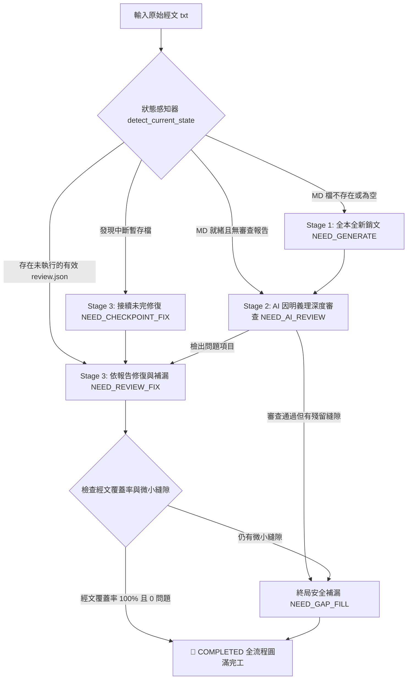

# 📖 佛經銷文斷句品質深度審查、一鍵修正與專注補漏工具 (`sutra.py`)

一套專為漢傳大藏經、梵漢對勘與各類文言原典設計的 **「高精度銷文解義、斷句品質審查、斷點補漏與物理槽位重排」** 全自動閉環流水線工具。

---

## 🌟 核心特性與底層機制

1. **⚡ DeepSeek Prompt Cache 極致最佳化**
   - 嚴格落實「靜態經文前置、動態指令後置」Prompt 結構，最大化鎖定 KV Cache 命中率，大幅縮短響應延遲並降低 API 成本（終端機即時輸出命中 Token 數與命中百分比）。
2. **🧠 因明義理與動態指針推進引擎 (Dynamic Pointer Engine)**
   - 移除非必要的硬性字數切分限制，由 AI 依佛教文法、因明論理、偈頌音律自主決定最佳斷句邊界。
   - 具備「後綴錨點精準裁切」技術，長區間經文自動連續推進，徹底杜絕人工硬切、跳字遺漏與句首定型句回跳。
   - 內建**末尾弱助詞防死鎖保護**（自動消化 `者、也、耳、矣、焉、哉、乎、耶、兮、歟、之` 等殘餘單字）。
3. **🎯 雙標點體系全能適配 (`detect_punctuation_style`)**
   - **現代新標點文本**：精準識別逗號、冒號、分號、引號，嚴防標點腰斬。
   - **古典全句號文本**：通篇皆為句號時，智慧判定合法句讀與科判停頓，避免過度暴力合併。
   - **無標點白文原典**：支援純漢字白文經文自動推進與分段銷文。
4. **🔤 古籍文字學異體字單向歸一化 (`VARIANT_CHAR_MAP`)**
   - 內建 23+ 組古今異體字對齊映射（如 `媅➔耽`、`睹➔覩`、`麤/麁➔粗`、`併➔并`、`嗔➔瞋`、`倶➔俱`、`缽➔鉢`、`祗/袛/衹/只➔祇`、`墮➔堕`、`辨➔辯`、`鷄➔雞`），徹底消除字形差異導致的定位漂移與漏段誤判。
5. **🛡️ 嚴格品質校驗與在地零延遲修復 (Local Fast-Fix)**
   - **五重品質防線**：防腰斬、防半偈、防起點跳字、防省略號（嚴禁 `...` / `（中略）`）、防結構欄位殘缺。
   - **在地極速修復**：開頭孤立標點/括號殘肢（如 `🔹 原典：「）」`）自動在本地以正則清洗修復，**0 延遲且不耗費任何 API 額度**。
6. **🔑 多金鑰池 (Key Pool) 自動輪換與 429 智慧自癒**
   - 支援單一檔案配置多把 Key，遇 `429 頻率限制` 或額度耗盡時，自動於 **2 秒內切換至下一把 Key 立即重試**。
   - 單金鑰模式遇 429 自動冷卻 30 秒退避重試；免費模型自動啟動 **15 秒請求頻率保護器**。
7. **💾 斷點續傳 (Checkpoint) 與多層級檔案鎖容錯**
   - 支援中途斷網/額度耗盡安全暫存（`_checkpoint.json`），再次執行即可「秒級接續」。
   - 針對 Windows / OneDrive 雲端同步檔案鎖設計指數退避原子寫入與**緊急另存防禦機制**（`.emergency_[時間戳].txt`），確保資料絕對不遺失。
8. **🧠 推理模型即時思考指示**
   - 針對 DeepSeek-R1、Gemini 思考模式輸出即時心跳（`🧠`），即時掌握模型推理狀態。

---

## 📦 安裝與環境準備

### 1. 安裝依賴套件
本工具僅依賴官方 `openai` Python SDK（相容 DeepSeek 官方、Google AI Studio、OpenRouter、OpenCode 等所有相容端點）：
```bash
pip install openai
```

### 2. 配置 API 金鑰
支援三種配置方式（優先順序：**命令列參數 > 環境變數 > 金鑰檔案**）：

#### 方式 A：檔案放置（推薦，支援多 Key 輪替）
在 `sutra.py` 相同目錄下建立對應的文字檔（**支援一行一把 Key、逗號/分號分隔、引號包裹以及 `#` 或 `//` 註解**）：

| 提供商 / 模式 | 優先讀取的金鑰檔名（擇一建立即可） |
| :--- | :--- |
| **Google Gemini 免費端點** | `gemini_key.txt`、`google_key.txt`、`gemini_api_key.txt`、`api_key.txt` |
| **OpenRouter / Free GLM** | `openrouter_key.txt`、`openrouter_api_key.txt`、`glm_key.txt`、`api_key.txt` |
| **OpenCode 平台 (Go / Zen)** | `opencode_key.txt`、`opencode_api_key.txt`、`api_key.txt` |
| **DeepSeek 官方 API** | `api_key.txt`、`deepseek_key.txt`、`deepseek_api_key.txt`、`key.txt` |

> 💡 **多金鑰輪換範例（`api_key.txt`）**：
> ```text
> # 主金鑰
> sk-d9a8f...01
> # 備用金鑰（遇 429 自動 2 秒無縫輪換）
> sk-b7c2e...02
> sk-ff19a...03
> ```

#### 方式 B：設定環境變數
```bash
# Linux / macOS
export DEEPSEEK_API_KEY="sk-xxxxxxxxxxxxxxxx"      # DeepSeek 官方
export GEMINI_API_KEY="AIzaSy-xxxxxxxxxxxxxx"      # Google AI Studio
export OPENROUTER_API_KEY="sk-or-v1-xxxxxxxxx"     # OpenRouter / GLM
export OPENCODE_API_KEY="sk-xxxxxxxxxxxxxxxx"      # OpenCode
export OPENAI_API_KEY="sk-xxxxxxxxxxxxxxxx"        # 通用 Fallback

# Windows PowerShell
$env:DEEPSEEK_API_KEY="sk-xxxxxxxxxxxxxxxx"
$env:GEMINI_API_KEY="AIzaSy-xxxxxxxxxxxxxx"
$env:OPENROUTER_API_KEY="sk-or-v1-xxxxxxxxx"
$env:OPENCODE_API_KEY="sk-xxxxxxxxxxxxxxxx"
```

#### 方式 C：命令列直接傳入
```bash
python sutra.py --file 1.txt --api-key "sk-xxxxxxxxxxxxxxxx"
```

---

## 🚀 常用指令速查 (Cheat Sheet)

| 應用情境 | 執行指令 | 說明 |
| :--- | :--- | :--- |
| **★ 一鍵全自動閉環 (最推薦)** | `python sutra.py --file 1.txt` | 預設模式，自動感知狀態（全新銷文 ➔ 深度審查 ➔ 瑕疵修復 ➔ 終局補漏） |
| **從零全本全新銷文** | `python sutra.py --file 1.txt --generate` | 將整篇經文視為大漏段，從頭至尾推進產出銷文（別名：`--gen`） |
| **專注補漏掃描** | `python sutra.py --file 1.txt --fix-gaps` | 快速比對原始經文，將漏掉的字句補齊並物理歸位（別名：`--gaps`） |
| **僅執行 AI 深度審查** | `python sutra.py --file 1.txt --review` | 不修改檔案，產出因明與斷句分析報告 `1_銷文_review.json` |
| **預覽修正清單 (Dry Run)** | `python sutra.py --file 1.txt --fix --dry-run` | 讀取 review.json 預覽待修項目，**不呼叫 API 且不更動檔案** |
| **依報告執行修復** | `python sutra.py --file 1.txt --fix` | 讀取 review.json 針對標記問題段落進行重新銷文與合併重排 |
| **使用 Google Gemini 免費模型** | `python sutra.py --file 1.txt --gemini` | 使用 Google AI Studio 端點（預設 `gemini-flash-latest`，別名：`--google`） |
| **使用 OpenRouter Free GLM 5.2** | `python sutra.py --file 1.txt --free-glm` | 使用 OpenRouter 免費端點（預設 `z-ai/glm-5.2:free`，別名：`--glm`、`--glm5`） |
| **切換 OpenCode Go 訂閱端點** | `python sutra.py --file 1.txt --opencode` | 使用 `https://opencode.ai/zen/go/v1` 訂閱端點（別名：`--go`） |
| **切換 OpenCode Zen 計量端點** | `python sutra.py --file 1.txt --zen` | 使用 `https://opencode.ai/zen/v1` 按量計費端點 |
| **開啟即時除錯輸出 (Debug)** | `python sutra.py --file 1.txt --debug` | 於終端機即時印出每次模型回傳的完整原始內容 (Raw Content) |

---

## 🛠️ 詳細工作模式與流水線架構

### 1. 🌟 一鍵全流程閉環流水線 (`--auto` / 預設)
系統內建具備防死鎖機制的**智慧狀態機（Pipeline State Machine）**，自動判斷切入點：



### 2. ⚡ 專注補漏模式 (`--fix-gaps` / `--gaps`)
- **適用場景**：銷文中途因 API 中斷、模型跳字、漏掉開頭引言或品題。
- **運作機制**：利用「全域布林覆蓋遮罩（Boolean Coverage Mask）」精確比對原始經文與 MD 現有段落，快速掃描所有漏段區間，調用動態指針引擎補齊，並依照經文原始幾何順序**物理插入回正確段落位置**。

### 3. 🔍 獨立審查與修復模式 (`--review` & `--fix`)
- **審查階段 (`--review`)**：
  1. 執行純物理預檢（字詞碎首、斷尾、非整偈 5/7 言殘句、開頭孤立符號、全域漏段）。
  2. 調用 AI 進行深層因明文法與科判審查（條件句懸空、重複內容、單段過長拆分建議）。
  3. 產出標準 JSON 審查報告 `[檔名]_銷文_review.json`。
- **修復階段 (`--fix`)**：
  讀取審查報告，針對問題區間重新切片、呼叫 AI 重寫合併，修復完成後自動清除快取報告。

---

## ⚖️ 義理審查與科判放行準則

為求「微觀句意自足、宏觀利於深解」，系統內建嚴謹的審查與放行規範：

| 類別 | 審查規則 | 處理動作 |
| :--- | :--- | :--- |
| **字詞/專有名詞跨段腰斬** | 如前段末「阿彌陀」，後段首「佛」 | 通報合併修復 (`merge_indices: [i, i+1]`) |
| **半偈殘篇** | 五言/七言韻文不足整偈（如單段僅 5/7/14 字） | 通報合併為整偈（4句 20/28 字） |
| **條件/因果前綴懸空** | 僅有假設子句（如「若彼所生」），無主句成義 | 通報與下段合併 |
| **單段過長臃腫** | 散文 >80~100 字且包含多個可獨立開示的法義句 | 通報拆分 (`type: 單段過長需拆分, merge_indices: [i]`) |
| **序號列舉條目** | 帶序號或法相標籤（如「一者、諦實故；」「二者...」） | **堅決放行（嚴禁合併或判定為碎片）** |
| **設問徵起與精簡問答** | 「所以者何」、「何以故」、「王言：不也。」 | **堅決放行（合法獨立總標/問答）** |

---

## 📝 產出格式規範

生成的 Markdown 文件嚴格遵循傳統講經科判與現代義理通解結構：

```markdown
# 佛經銷文：般若波羅蜜多心經

🔹 原典：「觀自在菩薩。行深般若波羅蜜多時。照見五蘊皆空。度一切苦厄。」
🔸 釋詞：
- 觀自在：梵語 Avalokiteśvara，指於事理無礙、觀境自在之大菩薩。
- 照見：以無漏般若實相智慧深刻觀照、現量徹見。
- 五蘊：色、受、想、行、識，組成眾生身心之五種積聚。
🔸 銷文：
觀自在菩薩進入甚深般若波羅蜜多的實相觀照之中時，以無分別智慧現量徹見色、受、想、行、識五蘊本質皆是因緣所生、自性本空，由此超越並解脫一切生死苦難與災厄。

【詳解】：
此處顯發般若法門之實修核心...（深入剖析法相義理、因明論理與文脈轉折）

【義理通解】：
用現代佛學語言進行統攝與實修觀照啟發...（闡釋心性啟發與修持落實處）

---
```

---

## ⚙️ 完整命令列參數清單

```text
用法: sutra.py [-h] --file FILE [--output OUTPUT]
                [--auto | --generate | --fix-gaps | --review | --fix]
                [--dry-run] [--debug] [--model MODEL]
                [--reasoning-effort {low,medium,high}]
                [--max-fix MAX_FIX] [--timeout TIMEOUT]
                [--gemini] [--free-glm] [--opencode] [--zen]
                [--base-url BASE_URL] [--api-key API_KEY] [--api-key-file PATH]

必要參數:
  --file FILE                  原始經文 txt 檔案路徑（UTF-8 編碼）

模式選擇 (互斥，預設為 --auto):
  --auto                       ★ 啟動一鍵全自動閉環流水線（自動處理銷文、補漏、審查與修正）
  --generate, --gen            手動指定：全本從頭全新銷文
  --fix-gaps, --gaps           手動指定：專注掃描遺漏區間並補漏
  --review                     手動指定：僅執行語法與義理審查，產出 review.json
  --fix                        手動指定：讀取 review.json 執行段落修正

修復、除錯與推論參數:
  --output OUTPUT              目標銷文 MD 檔案路徑（預設自動推導為 [檔名]_銷文.md）
  --dry-run                    預覽待修正清單，不呼叫 API 且不更動檔案（配合 --fix 使用）
  --debug                      ★ 開啟除錯模式，即時印出每次模型回傳的完整原始文字 (Raw Output)
  --model MODEL                呼叫的模型名稱（預設：DeepSeek 官方為 deepseek-v4-flash；
                               Gemini 預設為 gemini-flash-latest；GLM 預設為 z-ai/glm-5.2:free）
  --reasoning-effort           思考深度級別：low | medium | high（預設：high）
  --max-fix MAX_FIX            單次批次修復的最大問題數（預設：50）
  --timeout TIMEOUT            單次 API 請求超時時間（秒，預設：300）

端點與 API 金鑰:
  --gemini, --google           ★ 使用 Google AI Studio Gemini 免費端點 (每日 1,500 次請求)
  --free-glm, --glm5, --glm    ★ 使用 OpenRouter Free GLM 5.2 免費模型端點
  --opencode, --go             ★ 使用 OpenCode Go 訂閱端點 (https://opencode.ai/zen/go/v1)
  --zen                        使用 OpenCode Zen 按量計費端點 (https://opencode.ai/zen/v1)
  --base-url BASE_URL          自訂相容 OpenAI 規範的 API 端點 URL
  --api-key API_KEY            直接於命令列指定 API Key 字串
  --api-key-file PATH          手動指定 API Key 檔案路徑
```

---

## 💡 常見問題與排錯指南 (FAQ)

### Q1: 遇到網路中斷、API 額度耗盡或按 `Ctrl+C` 終止怎麼辦？
> **完全不必擔心！進度已安全保存。**
> 1. 系統具備即時 **斷點快取（`_checkpoint.json`）** 與 **安全寫入（`.bak`）** 機制，每完成一個子單元即時同步至硬碟。
> 2. 恢復連線或換 Key 後，**直接再次執行原指令**，系統將自動偵測暫存檔並「秒級接續未完進度」！

### Q2: 出現「Windows 檔案被鎖定 / PermissionError」？
> 本工具內建檔案鎖指數退避重試機制（針對 OneDrive / 雲端硬碟即時同步鎖定）。若檔案被外部編輯器完全佔用無法覆蓋，系統會自動啟動 **緊急另存機制（另存為 `.emergency_[時間戳].txt`）**，確保產出成果永不遺失。

### Q3: 古典全句號經文（通篇皆為 `。`）會不會被誤切過碎或過度合併？
> 不會。系統內建風格探測器（`detect_punctuation_style`），全句號文本會自動啟用寬鬆合併策略，允許語意自足的單元（包括「所以者何」、「王言：不也。」等徵起句與問答）獨立成段。

### Q4: 如何設定多把 API Key 突破 429 頻率限制？
> 在金鑰文字檔（如 `gemini_key.txt`、`openrouter_key.txt` 或 `api_key.txt`）中**換行貼上多組 Key** 即可。系統自動建置金鑰池，遇到 429 或配額異常時將**在 2 秒內切換至下一把 Key 立即重試**。

---

## 📜 開源協議
本專案採用 **MIT License** 釋出，歡迎隨喜流通、研究與改進，功德無量。