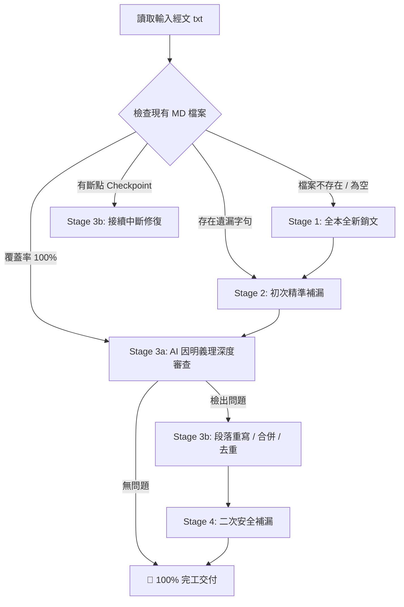

# 📖 佛經銷文斷句品質深度審查、一鍵修正與專注補漏工具 (`sutra.py`)

一套專為佛經文言原典設計的 **「高精度銷文解義、斷句品質審查、斷點補漏與物理物理對齊重排」** 自動化流水線工具。

---

## 🌟 核心特性

1. **⚡ DeepSeek Prompt Cache 極致最佳化**
   - 嚴格遵循「靜態前置、動態後置」架構，極大化 Prompt KV Cache 命中率，大幅降低 API 延遲與使用費用。
2. **🧠 因明義理與動態指針推進引擎**
   - 移除非必要的硬性字數門檻，由 AI 自主依佛學法義結構（義理完備、偈頌音律、問答對偶）進行自然切分。
   - 採用「動態文本指針與後綴錨點精準裁切」，長區間經文自動連續消化，徹底杜絕手動硬切與跳字遺漏。
3. **🎯 雙標點體系全能相容**
   - **現代新標點文本**：精準辨識逗號、冒號、引號、分號，防止腰斬。
   - **古典全句號文本**：通篇僅有句號時，智慧判定正常句讀與停頓，避免過度暴力合併。
4. **🛡️ 嚴格品質校驗與重試防護**
   - 內建多道防線：防腰斬、防半偈、防起點跳字、防省略號（禁止 `...` / `（中略）`）、防格式殘缺。
5. **💾 斷點續傳 (Checkpoint) 與檔案鎖容錯**
   - 支援中途斷網/額度耗盡安全暫存，重新執行即刻「秒級接續」。
   - 針對 Windows / OneDrive 檔案鎖設計指數退避與緊急另存機制，確保銷文成果絕不遺失。

---

## 📦 安裝與環境準備

### 1. 安裝依賴套件
本工具僅需官方 `openai` Python SDK（相容 DeepSeek 及各類相容端點）：
```bash
pip install openai
```

### 2. 配置 API 金鑰
支援三種配置方式（優先順序：**命令列參數 > 環境變數 > 金鑰檔案**）：

* **方式 A：檔案放置（推薦，最方便）**
  在 `sutra.py` 同層目錄下建立檔案：
  - 使用 DeepSeek 官方 API：建立 `api_key.txt` 或 `deepseek_key.txt`，貼入金鑰（如 `sk-...`）。
  - 使用 OpenCode 平台：建立 `opencode_key.txt`，貼入金鑰。

* **方式 B：設定環境變數**
  ```bash
  # Linux / macOS
  export DEEPSEEK_API_KEY="sk-xxxxxxxxxxxxxxxxxxxxxxxx"
  # 或 OpenCode
  export OPENCODE_API_KEY="sk-xxxxxxxxxxxxxxxxxxxxxxxx"

  # Windows PowerShell
  $env:DEEPSEEK_API_KEY="sk-xxxxxxxxxxxxxxxxxxxxxxxx"
  ```

* **方式 C：命令列直接傳入**
  ```bash
  python sutra.py --file 1.txt --api-key "sk-xxxxxxxxxxxxxxxx"
  ```

---

## 🚀 常用指令速查 (Cheat Sheet)

| 應用情境 | 執行指令 | 說明 |
| :--- | :--- | :--- |
| **★ 一鍵全自動閉環 (最推薦)** | `python sutra.py --file 1.txt` | 預設模式，自動感知狀態（全本銷文 ➔ 補漏 ➔ 審查修復 ➔ 二次補漏） |
| **從零全新銷文** | `python sutra.py --file 1.txt --generate` | 將整篇經文視為未處理區間，從頭到尾自動推進完成銷文 |
| **專注補漏掃描** | `python sutra.py --file 1.txt --fix-gaps` | 快速掃描現有 `.md` 漏掉的字句，補齊後依物理順序歸位 |
| **僅執行 AI 深度審查** | `python sutra.py --file 1.txt --review` | 不修改檔案，僅產出審查報告 `1_銷文_review.json` |
| **預覽修正清單 (Dry Run)** | `python sutra.py --file 1.txt --fix --dry-run` | 讀取 review.json 預覽待修項目，**不呼叫 API 且不更動檔案** |
| **依報告執行修正** | `python sutra.py --file 1.txt --fix` | 讀取 review.json 針對標記問題段落進行重新銷文與合併 |
| **切換 OpenCode Go 訂閱端點** | `python sutra.py --file 1.txt --auto --opencode` | 使用 `https://opencode.ai/zen/go/v1` 端點 |
| **切換 OpenCode Zen 計量端點** | `python sutra.py --file 1.txt --auto --zen` | 使用 `https://opencode.ai/zen/v1` 端點 |

---

## 🛠️ 詳細工作模式解析

### 1. 🌟 一鍵全流程閉環流水線 (`--auto`)
系統內建智慧狀態機（State Machine），會根據輸入與現有檔案狀態自動切換：


### 2. ⚡ 專注補漏模式 (`--fix-gaps`)
- **適用場景**：先前銷文過程中因中斷、模型跳字、漏掉開頭引言或結尾偈頌。
- **運作機制**：利用全域布林遮罩（Boolean Coverage Mask）進行經文幾何定位，找出所有未銷文的經文夾縫，自動呼叫推進引擎補齊，並依照經文原始順序**物理插入回正確位置**。

### 3. 🔍 獨立審查與修復模式 (`--review` & `--fix`)
- 透過 `--review` 產出 JSON 格式的審查報告（包含字詞腰斬、半偈殘篇、條件句懸空、重複內容等問題）。
- 可手動檢視/微調 `[檔名]_銷文_review.json` 內容。
- 透過 `--fix` 依據報告執行重寫；修復完畢後報告自動歸檔/清理。

---

## 📝 產出格式規範

本工具生成的銷文 Markdown 文件嚴格遵循傳統講經科判與現代義理通解格式：

```markdown
# 佛經銷文：心經

🔹 原典：「觀自在菩薩。行深般若波羅蜜多時。照見五蘊皆空。度一切苦厄。」
🔸 釋詞：
- 觀自在：梵語 Avalokiteśvara，指於事理無礙、觀境自在之大菩薩。
- 照見：以無漏般若實相智慧深刻觀照、現量徹見。
- 五蘊：色、受、想、行、識，組成眾生身心之五種積聚。
🔸 銷文：
觀自在菩薩進入甚深般若波羅蜜多的實相觀照之中時，以無分別智慧現量徹見色、受、想、行、識五蘊本質皆是因緣所生、自性本空，由此超越並解脫一切生死苦難與災厄。

【詳解】：
此處顯發般若法門之實修核心...（剖析法相義理與因明論理）

【義理通解】：
用現代佛學語言進行統攝與實修觀照啟發...

---
```

---

## ⚙️ 完整命令列參數清單

```text
用法: sutra.py [-h] --file FILE [--output OUTPUT]
                [--auto | --generate | --fix-gaps | --review | --fix]
                [--dry-run] [--model MODEL]
                [--reasoning-effort {low,medium,high}]
                [--max-fix MAX_FIX] [--timeout TIMEOUT]
                [--opencode] [--zen] [--base-url BASE_URL]
                [--api-key API_KEY] [--api-key-file API_KEY_FILE]

必要參數:
  --file FILE           原始經文 txt 檔案路徑（UTF-8 編碼）

模式選擇 (互斥，預設為 --auto):
  --auto                ★ 啟動一鍵全自動閉環流水線（自動處理銷文、補漏、審查與修正）
  --generate, --gen     手動指定：全本從頭全新銷文
  --fix-gaps, --gaps    手動指定：專注掃描遺漏區間並補漏
  --review              手動指定：僅執行語法與義理審查，產出 review.json
  --fix                 手動指定：讀取 review.json 執行段落修正

修復與推論微調參數:
  --output OUTPUT       目標銷文 MD 檔案路徑（預設自動推導為 [檔名]_銷文.md）
  --dry-run             預覽待修正清單，不呼叫 API 且不更動檔案
  --model MODEL         呼叫的模型名稱（預設：deepseek-v4-flash / deepseek-chat）
  --reasoning-effort    思考深度級別：low | medium | high（預設：high）
  --max-fix MAX_FIX     單次批次修復的最大問題數（預設：50）
  --timeout TIMEOUT     單次 API 請求超時時間（秒，預設：300）

端點與 API 金鑰:
  --opencode, --go      ★ 使用 OpenCode Go 訂閱端點 (https://opencode.ai/zen/go/v1)
  --zen                 使用 OpenCode Zen 按量計費端點 (https://opencode.ai/zen/v1)
  --base-url BASE_URL   自訂相容 OpenAI 規範的 API 端點 URL
  --api-key API_KEY     直接指定 API Key 字串
  --api-key-file PATH   指定 API Key 檔案路徑
```

---

## 💡 常見問題與排錯指南 (FAQ)

### Q1: 遇到網路斷線或 API 額度耗盡中止怎麼辦？
> **完全不必擔心！**
> 1. 系統具備即時 **斷點快取（`_checkpoint.json`）** 與 **原子寫入（`.bak`）** 機制。
> 2. 待網路恢復或補足額度後，**直接重新執行同一行指令**，程式將自動偵測並讀取已完成的進度，直接從中斷處接續推進！

### Q2: 出現「Windows 檔案被鎖定 / PermissionError」？
> 本工具內建檔案鎖退避機制（針對 OneDrive / 雲端硬碟即時同步鎖定）。若檔案依然被特定編輯器完全佔用，系統會自動啟動 **緊急另存防禦機制（另存為 `.emergency_[時間戳].txt`）**，確保 AI 產出的珍貴銷文成果絕對不遺失。

### Q3: 古典全句號經文（通篇皆為 `。`）會不會被誤切過碎或過度合併？
> 不會。系統具備標點風格自動探測器（`detect_punctuation_style`），針對全句號文本會自動放寬合併判定，允許語意自足的單元（包括「所以者何」、「王言：不也。」等徵起句與精簡問答）獨立成段。

---

## 📜 開源協議
本專案採用 **MIT License** 釋出，歡迎隨喜流通、研究與改進，功德無量。